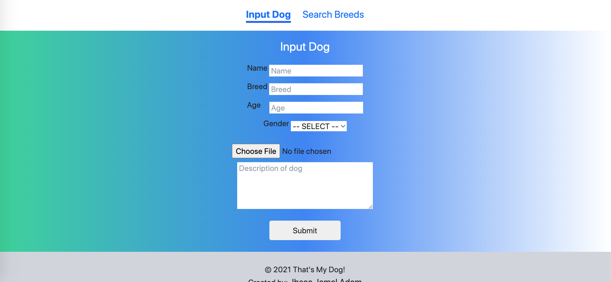
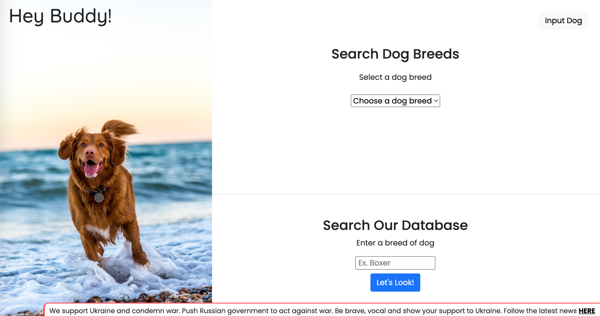

# Hey Buddy PHP MySQL Dog Search & Input Website

Site first designed with Figma then coded with Bootstrap5, CSS3, JavaScript, PHP, & MySQL. Deployed with 000webhostapp.com.

## Table of contents

- [Screenshots Old Design](#screenshots-old)
- [Screenshots New Design](#screenshots-new)
- [Technologies](#technologies)
- [New Site Live Demo](#live-demo-new)
- [Link To New Design File](#design-file)
- [Contact](#contact)

## Screenshots Old

## Screenshots New

## Technologies

- Figma, Bootstrap5, CSS3, JavaScript, PHP, & MySQL. Deployed with 000webhostapp.com.

## Live Demo New

View live demo here: [Demo](https://thatsmydog.online/)

## Design File

View Figma design file here: [Figma File](https://www.figma.com/file/rR2re95veVtcfxBzLdlej8/Hey-Buddy!?node-id=0%3A1)

## Contact

Created by [Ibsaa J Adam](https://github.com/ibsaajadam) - feel free to contact on:
You can find me also on:

- [Linkedin](https://www.linkedin.com/in/ibsaajadam/)
- [Github](https://github.com/ibsaajadam)
